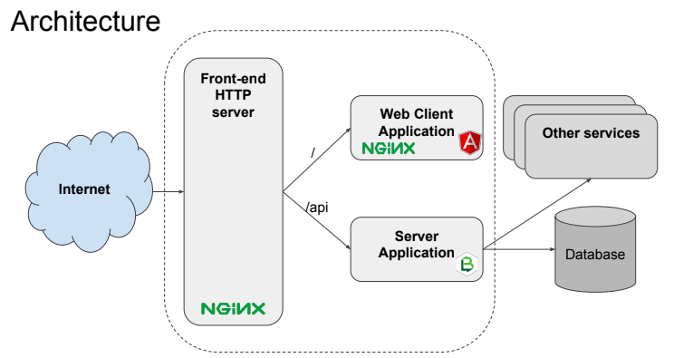

# glsdk-project
Starter for the Grand Lyon Software Development Kit (gather glsdk-server, glsdk-client, glsdk-proxy as submodules)


GrandLyon Starter Kit Developpement is an application build with these framework :
 - Module server : [NodeJS] application with [LoopBack] framework
 - Module client : [Angular] application and [FireLoop] framework for connexion to module server



Install
------------

```
npm run init
npm run install
```

```
cd server && docker-compose up
npm run start-server
npm run start-webapp

```
 * http://localhost:4200
 * http://localhost:3000/explorer


Quickstart 
------------

 * [Setup] new project from this SDK.
 * [Starting] with the SDK. 


License
------------
MIT

[NodeJS]: http://nodejs.org
[FireLoop]: http://fireloop.io
[Angular]: http://angular.io
[LoopBack]: http://loopback.io
[TypeScript]: https://www.typescriptlang.org
[Setup]: SETUP.md
[Starting]: QUICKSTART.md